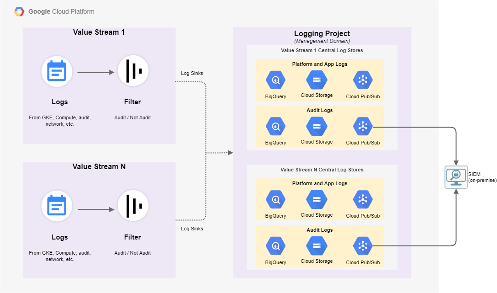

# CAP Logging


This module comprises of Terraform code for enabling centralised logging.

## Centralised Logging Considerations

The CAP logging architecture is based on the below mentioned considerations

Consideration | Description
------------- | -----------
Log Aggregation | Logs need to be aggregated and viewed centrally
Segregation of Security logs | Security logs need to be stored in a different data store than from other logs
Log Correlation | Ability to correlate between different types of logs is needed
Access Control | Logs need to be access controlled
Encryption | Logs need to be encrypted
Retention | Various log types need to be retained for a specified period of time
Integration with external log systems | Ability to integrate with external log systems on the enterprise - such as Splunk, etc. is needed


## Centralised Logging Architecture



### Logging Architecture Explained

* A logging project is created in the management domain. This project hosts log stores for each value stream
* There are two sets of central log stores created for each value stream
    * Audit / Security log store - contains only audit logs for the value stream
    * Platforma and app log store - contains logs from GCP platform service (such as GKE, etc.) as well as logs from application running using these GCP services
* Each log store comprises of the following GCP services
    * GCS Bucket - for long term retention and archival of logs
    * Big Query data set - for near term analysis of logs
    * Pub-sub - for near real time analysis of logs
* GCS buckets holding the logs as well as Big Query data sets are encrypted using CMEK pattern with HSM backed keys
* GCS buckets holding the logs  as well as Big Query data sets have dataclassification = "highly confidential" for security log store
* The GCS / BigQuery sinks are used for reproducing SIEM functionality on GCP but require additional work and operational considerations
* The PubSub sink is used for forwarding to Splunk (or equivalent system on premise) and CAP assumes that the work of what such system does with logs is managed elsewhere


# Usage

The following assumes that it is run in an already created logging project, with a key set up for use by the default storage and bigquery service accounts.

```
module log_exporter_bucket {
  source = "../modules/logging/log-export"

  destination_uri        = module.log_destination_bucket.destination_uri
  filter                 = ""
  log_sink_name          = "folder-log-bucket"
  parent_resource_id     = module.common_folder.folder.folder_id
  parent_resource_type   = "folder"
  unique_writer_identity = true
  include_children       = true
}

module log_destination_bucket {
  source = "../modules/logging/storage"

  prefix                   = "folder"
  project_id               = module.project.project.project_id
  storage_bucket_name      = "folder_logging_sanscaffeine"
  location                 = "EU"
  log_type                 = "TEST"
  key_name                 = google_kms_crypto_key.key.id
  log_sink_writer_identity = module.log_exporter_bucket.writer_identity
}

module log_exporter_bigquery {
  source = "../modules/logging/log-export"

  destination_uri        = module.log_destination_bigquery.destination_uri
  filter                 = ""
  log_sink_name          = "folder-log-bigquery"
  parent_resource_type   = "folder"
  parent_resource_id     = module.common_folder.folder.folder_id
  unique_writer_identity = true
  include_children       = true
}

module log_destination_bigquery {
  source = "../modules/logging/bigquery"

  prefix                   = "folder"
  project_id               = module.project.project.project_id
  dataset_name             = "folder_log"
  location                 = "EU"
  log_type                 = "DEFAULT"
  key_name                 = google_kms_crypto_key.key.name
  log_sink_writer_identity = module.log_exporter_bigquery.writer_identity
}


module log_exporter_pubsub {
  source = "../modules/logging/log-export"

  destination_uri        = module.log_destination_pubsub.destination_uri
  filter                 = ""
  log_sink_name          = "folder-log-pubsub"
  parent_resource_id     = module.common_folder.folder.folder_id
  parent_resource_type   = "folder"
  unique_writer_identity = true
  include_children       = true
}

module log_destination_pubsub {
  source = "../modules/logging/pubsub"

  prefix                   = "folder"
  project_id               = module.project.project.project_id
  topic_name               = "folder-log"
  create_subscriber        = true
  log_type                 = "DEFAULT"
  key_name                 = google_kms_crypto_key.key.name
  log_sink_writer_identity = module.log_exporter_pubsub.writer_identity
}
```
