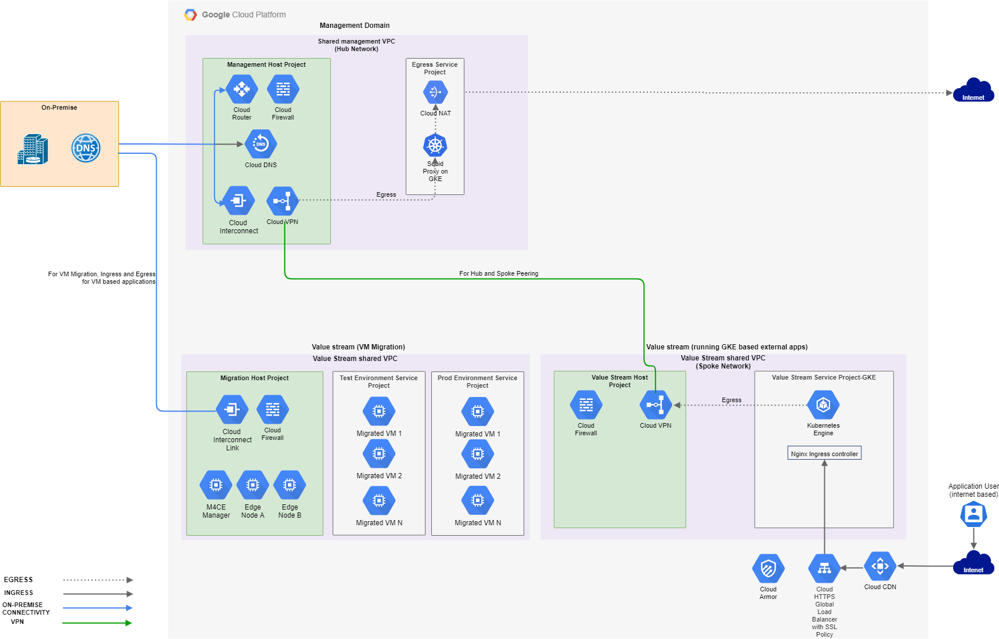

# CAP Networking
This module comprises of Terraform code for provisioning multiple networking components such as VPCs, Subnets, VPN, Firewall rules, DNS and NAT. The modules related to these components are invoked from the management and value stream repos.

## Network Design Considerations

The CAP network architecture is based on the value stream approach. The network architecture is based on the below mentioned considerations

Consideration | Description
------------- | -----------
Centralised Network for common / shared services | Certain services such as NAT, DNS routing to on premise, IDS / IPS, On premise connectivity, etc will need to be managed centrally across value streams
Network Connectivity | - No connectivity by default between environments   - Value streams may need to access services running on premise   - Services running on premise may need to access value stream services on cloud   - Value streams may need to access 3rd party services over the internet   - 3rd party services may need to access services hosted by value streams   - Egress to the internet should be centrally managed

## Overall Network Layout for CAP

### Hub and Spoke Pattern
The network architecture is based on the hub and spoke pattern. A management VPC is created which acts as the hub network and is responsible for hosting services and capabilities that will be commonly needed across all value streams

Each value stream has it's own VPC which is used to provide networking capabilities to the GCP services and applications within the value stream. The hub and spoke are connected using VPN in general.

The above pattern is repeated for production and non-production environment with a separate management VPC for all non-production environments.

### Value stream - running GKE based external applications
This value stream hosts externally facing web based applications running on GKE. This value stream has a shared VPC. The host project is responsible for hosting services that are common to the value stream such as VPN, firewall, etc. The service project hosts GKE. Ingress to the applications from the internet is managed via GCLB which sits behind a CDN and has cloud armor policies bound to it. Egress to the internet is managed via the centralised egress project in the management domain.

### Value stream - VM Migration
A dedicated value stream has been created for managing migrations from on-premise to cloud. This value stream leverages cloud interconnect to provide high bandwidth connectivity between on-premise and cloud that is essential migrating VMs efficiently. The host project has common services such as cloud interconnect and Firewall as well as resources for running Migrate for compute engine. The service projects is where VMs are migrated by the migrate for compute engine. There is a service project each for test and production environment.

### Ingress
Ingress from the internet is managed by individual value streams. For more details refer to the [ingress design document](./README_Ingress.md)

### Egress
Egress to the internet is centrally managed from within the management VPC. For more details refer to the [egress design document](./README_Egress.md)
