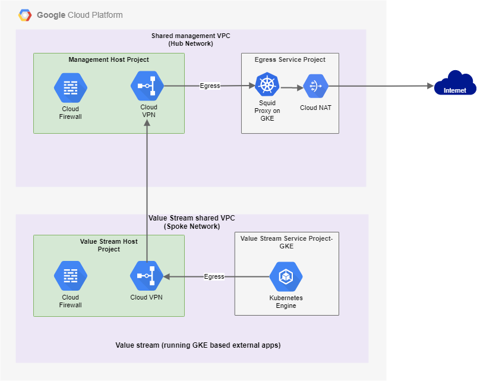

# CAP Egress

The egress design for CAP is based on the below mentioned considerations

Consideration | Description
------------- | -----------
Centralised Management of Egress to internet | Egress to the internet needs to be managed centrally to ensure granular level of control over traffic exiting to the internet
Specific public endpoints for services | All applications that require access to the internet must only be exposed via a specific set of IP addresses
IP / URL Filtering | The design must provide the ability to restrict outbound connectivity to a specific set of IP addresses / URLs on the internet

## Egress Design

### Egress Design Explained

* Egress is managed centrally from the management domain
* An Egress service project is created in the management domain which has the following components hosted in it:
    * Squid proxy installation which is specified as the next destination for internet based traffic from the value stream VPC
    * A Cloud NAT instance which egresses to the internet is used by the Squid proxy as the next hop for all internet based traffic
* Traffic destined to the internet from the value stream VPC traverses via the VPN tunnel between the value stream VPC and the management VPC